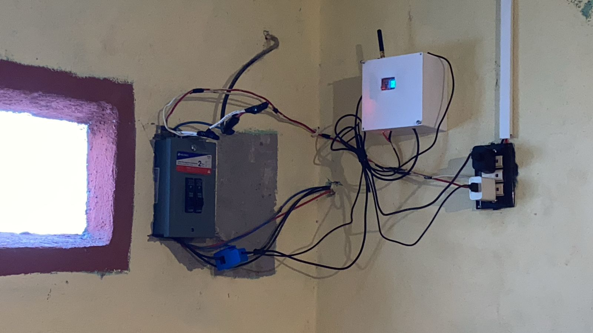
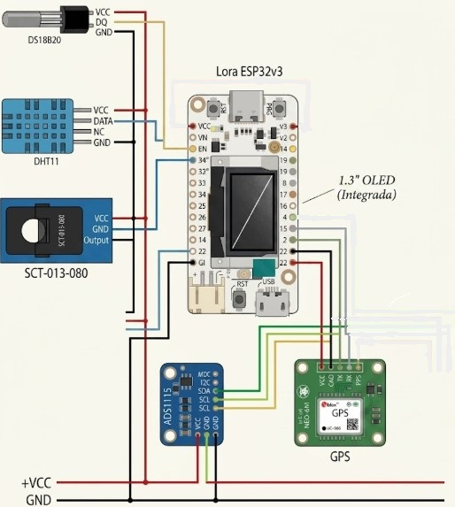
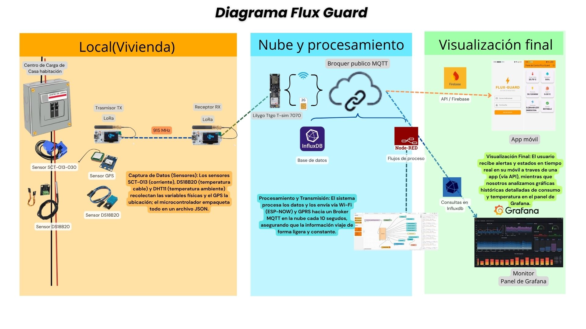

# Integrantes:
- 230110252 Ángeles Martínez Dilan Emir
- 230110346 Bernal Franco Lizbeth de Jesús 
- 230110322 Cruz Martinez Alejandro 
- 220111989 Gress Ugarte María Guadalupe
- 230110716 Maldonado Olguín Irving
### Semestre y Grupo: 6 "B"

# FluxGuard: Sistema IoT inalámbrico para monitoreo eléctrico en casa habitación mediante tecnología LoRa
Sistema IoT para monitoreo eléctrico en casa habitación mediante tecnologías inalámbricas LoRa, Wi-Fi y GPRS.

# Introduccón 
FluxGuard es un prototipo basado en IoT diseñado para el monitoreo remoto de instalaciones eléctricas residenciales con el fin de prevenir riesgos. El sistema utiliza un microcontrolador ESP32 y sensores para medir corriente (SCT-013-030), temperatura de conductores (DS18B20) y variables ambientales (DHT11). Para la transmisión de datos a largo alcance, emplea módulos Heltec ESP32 LoRa (915 MHz) y el protocolo MQTT, permitiendo la visualización de la información en tiempo real mediante Node-RED y Grafana. Este desarrollo demuestra la importancia y aplicación de las tecnologías inalámbricas y protocolos IoT en la supervisión y seguridad del hogar.

# Justificación
El desarrollo del prototipo FluxGuard surge ante la falta de sistemas de supervisión en tiempo real en las viviendas, lo que incrementa el riesgo de sobrecargas, cortocircuitos e incendios. Para solucionar esto, el proyecto integra sensores de corriente y temperatura con tecnologías inalámbricas (LoRa, Wi-Fi y GPRS), permitiendo la prevención de riesgos mediante el monitoreo remoto en plataformas IoT. De esta manera, el sistema aporta un impacto tecnológico y académico al evaluar la estabilidad y confiabilidad de la transmisión de datos, ofreciendo una solución funcional para la seguridad eléctrica residencial.

# Objetivos

## Objetivo general
Desarrollar un prototipo IoT basado en tecnologías inalámbricas LoRa, Wi-Fi y GPRS para el monitoreo en tiempo real de variables eléctricas en instalaciones de casa habitación, mediante sensores de corriente y temperatura integrados a una plataforma de supervisión remota, con la finalidad de analizar parámetros característicos de los sistemas inalámbricos, como la confiabilidad, interoperabilidad y consumo energético en la transmisión de datos, así como contribuir a la prevención de riesgos eléctricos y reducir daños en electrodomésticos.

## Objetivos especificos

- Implementar comunicación inalámbrica mediante módulos Heltec ESP32 LoRa y conectividad Wi-Fi/GPRS para la transmisión de datos entre los nodos del sistema, evaluando parámetros como alcance, estabilidad e interferencia en la comunicación.

- Desarrollar una plataforma de supervisión remota utilizando protocolo MQTT, Node-RED, InfluxDB y Grafana para visualizar en tiempo real las variables eléctricas obtenidas por los sensores y analizar el comportamiento del sistema.

# Requerimientos de Hardware y Software

## 🛠 Hardware

| Componente | Descripción |
|---|---|
| Heltec ESP32 LoRa V3 | Comunicación LoRa |
| SCT-013-030 | Sensor de corriente |
| DS18B20 | Sensor de temperatura |
| DHT11 | Sensor ambiental |
| LilyGO T-SIM7070G | Respaldo GPRS |
| Módulo GPS | Geolocalización del sistema |

## 💻 Software

| Software | Función |
|---|---|
| Arduino IDE | Programación |
| Node-RED | Dashboard |
| MQTT Broker | Comunicación |
| InfluxDB | Base de datos |
| Grafana | Visualización |

# Tabla de conexiones 

## Diagrama de conexiones 

## 🔹 Nodo Emisor (TX)

| Componente | Pin ESP32 | Descripción |
|---|---|---|
| DS18B20 | GPIO4 | Sensor de temperatura del conductor |
| DHT11 | GPIO5 | Sensor ambiental |
| GPS RX/TX | GPIO7 / GPIO6 | Comunicación GPS |
| ADS1115 SDA | GPIO41 | Comunicación I2C |
| ADS1115 SCL | GPIO42 | Comunicación I2C |
| OLED SDA | GPIO21 | Pantalla OLED |
| OLED SCL | GPIO18 | Pantalla OLED |
| LoRa SX1262 | SPI personalizado | Comunicación inalámbrica |

## 🔹 Nodo Receptor (RX)

| Componente | Pin ESP32 | Descripción |
|---|---|---|
| OLED SDA | GPIO21 | Pantalla OLED |
| OLED SCL | GPIO18 | Pantalla OLED |
| LoRa SX1262 | SPI personalizado | Recepción LoRa |

## 🔸 Gateway LilyGO T-SIM7070G

| Componente | Pin | Descripción |
|---|---|---|
| SIM7070 TX | GPIO27 | Comunicación módem |
| SIM7070 RX | GPIO26 | Comunicación módem |
| I2C SDA | GPIO21 | Comunicación I2C |
| I2C SCL | GPIO22 | Comunicación I2C |
| PWR MODEM | GPIO4 | Encendido del módem |

# Tabla de direccionamiento

| Elemento | Configuración |
|---|---|
| Frecuencia LoRa | 915 MHz |
| Canal ESP-NOW | 7 |
| Broker MQTT | broker.hivemq.com |
| Puerto MQTT | 1883 |
| Topic MQTT | itsoeh/mary_gress/fluxguard/datos |
| Protocolo de transmisión | MQTT |
| Tipo de comunicación local | LoRa |
| Tipo de comunicación Gateway | ESP-NOW |

# Esquema de Funcionamiento

### Descripción

El sistema FluxGuard realiza el monitoreo de variables eléctricas y ambientales en una instalación de casa habitación mediante sensores conectados a un nodo transmisor Heltec ESP32 LoRa. 

La información obtenida es enviada mediante tecnología LoRa hacia un nodo receptor, el cual retransmite los datos utilizando ESP-NOW hacia un gateway LilyGO T-SIM7070G.

Posteriormente, el gateway envía la información mediante protocolo MQTT utilizando conectividad GPRS o WiFi hacia plataformas de procesamiento y almacenamiento como Node-RED e InfluxDB.

Finalmente, los datos son visualizados mediante dashboards en Grafana y una aplicación móvil conectada mediante Firebase.

# Códigos del proyecto

## 🟦 Nodo Emisor (TX)
[Ver código TX](NodoEmisor_TX/NodoEmisor_TX.ino)

## 🟦 Nodo receptor (RX)
[Ver código RX](NodoReceptor_RX/NodoReceptor_RX.ino)

## 🟧 LilyGO T-SIM7070G
[Ver código Lilygo](Lilygo/Lilygo.ino)

# Configuración de sensores y tarjetas

## ◻ Heltec ESP32 LoRa V3
Los módulos Heltec ESP32 LoRa V3 fueron utilizados como nodo transmisor y receptor. 
La comunicación LoRa fue configurada a una frecuencia de 915 MHz, utilizando un Spreading Factor de 7, ancho de banda de 125 kHz y Coding Rate 4/5.

## ◼ Sensor SCT-013-030
El sensor SCT-013-030 fue utilizado para la medición de corriente eléctrica mediante lectura analógica usando el convertidor ADS1115.

## ◻ Sensor DS18B20
El sensor DS18B20 fue utilizado para medir la temperatura del conductor eléctrico mediante comunicación OneWire.

## ◼ Sensor DHT11
El sensor DHT11 fue implementado para medir temperatura ambiental y humedad relativa.

## ◻ Módulo GPS
El sistema incorpora un módulo GPS para obtener coordenadas de ubicación del dispositivo.

## ◼ Comunicación ESP-NOW
La comunicación entre el nodo receptor y el gateway LilyGO se realizó mediante ESP-NOW utilizando el canal 7.

## ◻ LilyGO T-SIM7070G
Fue configurado para enviar datos mediante protocolo MQTT utilizando conectividad GPRS y respaldo WiFi.

# Alimentación del prototipo

## ⚡ Alimentación fija
Los módulos Heltec ESP32 LoRa son alimentados mediante conexión USB y fuente regulada de 5V, permitiendo el funcionamiento continuo del sistema de monitoreo.

## 📶 Alimentación móvil
La LilyGO T-SIM7070G incorpora conectividad móvil mediante red GPRS, permitiendo el envío de datos hacia internet en lugares donde no se dispone de red WiFi.

## 🌐 Respaldo de conectividad
En caso de falla de la red móvil, el sistema puede utilizar conexión WiFi como mecanismo alternativo para mantener la transmisión de datos.

# Recomendaciones y precauciones

## 🔄 Recomendaciones de mejora
- Incorporar batería de respaldo para funcionamiento autónomo.
- Mejorar el sistema de geolocalización en tiempo real.
- Integrar algoritmos de detección inteligente de anomalías.
- Desarrollar una interfaz web dedicada para monitoreo remoto.

## 🛑 Precauciones
- Verificar correctamente las conexiones eléctricas antes de energizar el sistema.
- Evitar la exposición del prototipo a humedad o temperaturas extremas.
- Utilizar fuentes de alimentación reguladas.
- No manipular conductores eléctricos energizados sin supervisión.
- Asegurar el aislamiento de sensores y conexiones.

